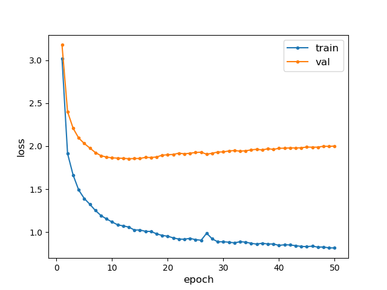
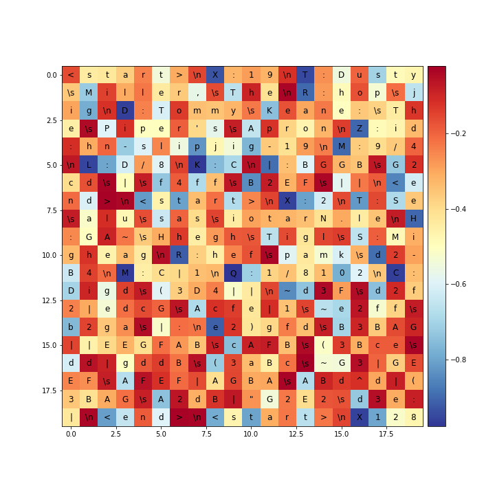

# CS253-PA4
**我佛了**
佛啥？
**佛前苦苦枯了**

---
`lstm.py`: preprocessing, build model, train and validate model

`compose.py`: generate music from best model

`test.py`: test the model on test set (loss)

---
`utils.py`: encoding utils for dataloader

`music_dataloader.py`: dataloader

